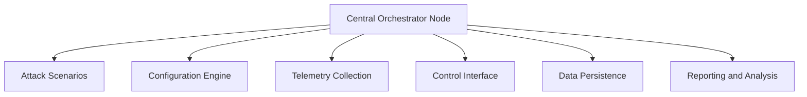

# 5G-O-RAN TestBed Orchestrator

## Description
The Orchestrator directory contains the control logic used to coordinate and execute adversarial campaigns across the UE, RAN, and Core components of a 5G O-RAN testbed. It provides a unified mechanism to launch, synchronize, and terminate attack phases while continuously collecting system and network telemetry required for resilience evaluation.

The orchestrator is designed to support repeatable, parameterized experiments, enabling controlled stress conditions and consistent comparison across baseline and defended configurations.

## Features
- **Campaign-driven execution**: 
  Defines multi-phase attack scenarios (e.g., UE attach flooding, RRC signaling storms, user-plane traffic bursts) using configuration files for reproducibility.

- **Cross-plane coordination**:
  Orchestrates adversarial activity spanning the UE, RAN, and Core planes, allowing evaluation of cascading and cross-layer effects.

- **Baseline and control toggles**:
  Supports running identical campaigns with security controls enabled or disabled (e.g., TLS, resource quotas, rate limits) to quantify resilience deltas.

- **Telemetry collection and timestamping**:
  Collects CPU, memory, signaling success rates, and throughput metrics with synchronized timestamps for recovery time and degradation analysis.

- **Experiment repeatability**:
  Enables repeated runs with configurable randomization (e.g., start offsets, intensity levels) to support statistical analysis.

- **Modular and extensible design**:
  Allows new attack modules, metrics collectors, or control hooks (e.g., RIC/A1/O1 triggers) to be added with minimal changes.

## Technical Architecture
The architecture of the **5G-O-RAN TestBed Orchestrator** can be summarized as follows:

### Technical Architecture Diagram


- **Central Orchestrator Node**: The main control logic that manages and coordinates all aspects of the testbed orchestration.
- **Attack Scenarios**: Modular drivers to simulate realistic adversarial activity across UE, RAN, and Core layers.
- **Configuration Engine**: Enables repeatable experiments with customizable attack parameters and modes.
- **Telemetry Collection**: Collects and synchronizes system metrics for performance and resilience evaluation.
- **Control Interface**: Adjusts security settings, quotas, and rate limits to enable controlled experiments.
- **Data Persistence**: Stores all experiment data and metadata for downstream analysis.
- **Reporting and Analysis**: Post-experiment tools to evaluate system resilience and generate usable results.

## Local Setup Instructions

To set up and run the **5G-O-RAN TestBed Orchestrator** locally:

### Pre-requisites
You will need the following:
- **Python 3.8+**
- **Pip** (Python package manager)
- **Linux Host** (for better compatibility with dependencies)
- **External 5G Components** (e.g., Open5GS, OAI, or simulators)

### Steps
1. **Clone the Repository**
   ```bash
   git clone https://github.com/Elinvicto/5G-O-RAN-TestBed-Orchestrator.git
   cd 5G-O-RAN-TestBed-Orchestrator
   ```

2. **Install Dependencies**
   - Install all required Python libraries using the provided `requirements.txt` file:
     ```bash
     pip install -r requirements.txt
     ```

3. **Run the Orchestrator**
   - Begin the main orchestration process by running:
     ```bash
     python orchestrator.py
     ```

4. **Access the Web Dashboard**
   - Open your web browser and navigate to:
     ```
     http://127.0.0.1:5000
     ```

5. **Customize Configuration**
   - Edit the `inventory.json` file to define attack targets or tweak settings for UE, RAN, and Core components.

6. **Run Attack Campaigns**
   - Launch coordinated campaigns using `attack_runner.py`:
     ```bash
     python attack_runner.py
     ```

## Docker Setup Instructions

For users who prefer using Docker, a pre-built image is available for rapid deployment. This setup is ideal for reproducible research environments.

### Steps

1. **Pull the Docker Image**
   - Pull the pre-built Docker image from Docker Hub:
     ```bash
     docker pull badishsec/5g-orchestrator
     ```

2. **Run the Web Dashboard**
   - Start the Orchestrator in web-dashboard mode:
     ```bash
     docker run -it --rm \
       --cap-add=NET_ADMIN \
       --network host \
       badishsec/5g-orchestrator
     ```
   - Access the dashboard at:
     ```
     http://localhost:5000
     ```

3. **Run Attack Runner (Standalone Script)**
   - To execute an attack campaign standalone (without the dashboard), run:
     ```bash
     docker run -it --rm \
       --cap-add=NET_ADMIN \
       --network host \
       badishsec/5g-orchestrator \
       python attack_runner.py
     ```

4. **Run Attack Emulator**
   - To perform low-level traffic generation or signaling stress, run:
     ```bash
     docker run -it --rm \
       --cap-add=NET_ADMIN \
       --network host \
       badishsec/5g-orchestrator \
       python attack_emulator.py
     ```

5. **Custom Scripts**
   - Add your scripts to the container and run them like so:
     ```bash
     docker run -it --rm \
       --cap-add=NET_ADMIN \
       --network host \
       badishsec/5g-orchestrator \
       python my_experiment.py
     ```

### Networking Notes
- Using `--network host` is recommended for realistic 5G experiments.
- The `--cap-add=NET_ADMIN` flag is required for raw socket operations (e.g., Scapy).

## Conclusion
The **5G-O-RAN TestBed Orchestrator** represents an innovative and robust framework for orchestrating adversarial campaigns in 5G O-RAN testbeds. This build is specifically compatible with the **NIST 5G O-RAN** infrastructure, making it ideal for researchers and developers working within this environment.

With the option for both local setup and Dockerized deployments, the orchestrator is flexible and accessible for various research use cases, including reproducible security experiments, baseline comparisons, and stress testing. 

We encourage contributions and collaboration! Feel free to fork the repository, test it out, and submit pull requests to enhance its functionality further. For those seeking convenience, the Docker image offers a ready-to-use environment to accelerate experimentation.
