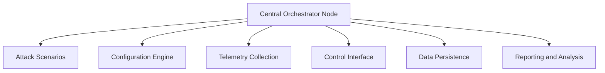

# 5G-O-RAN TestBed Orchestrator

## Description
The Orchestrator directory contains the control logic used to coordinate and execute adversarial campaigns across the UE, RAN, and Core components of a 5G O-RAN testbed. It provides a unified mechanism to launch, synchronize, and terminate attack phases while continuously collecting system and network telemetry required for resilience evaluation.

The orchestrator is designed to support repeatable, parameterized experiments, enabling controlled stress conditions and consistent comparison across baseline and defended configurations.

## Features
- **Campaign-driven execution**: 
  Defines multi-phase attack scenarios (e.g., UE attach flooding, RRC signaling storms, user-plane traffic bursts) using configuration files for reproducibility.

- **Cross-plane coordination**:
  Orchestrates adversarial activity spanning the UE, RAN, and Core planes, allowing evaluation of cascading and cross-layer effects.

- **Baseline and control toggles**:
  Supports running identical campaigns with security controls enabled or disabled (e.g., TLS, resource quotas, rate limits) to quantify resilience deltas.

- **Telemetry collection and timestamping**:
  Collects CPU, memory, signaling success rates, and throughput metrics with synchronized timestamps for recovery time and degradation analysis.

- **Experiment repeatability**:
  Enables repeated runs with configurable randomization (e.g., start offsets, intensity levels) to support statistical analysis.

- **Modular and extensible design**:
  Allows new attack modules, metrics collectors, or control hooks (e.g., RIC/A1/O1 triggers) to be added with minimal changes.

## Technical Architecture
The architecture of the **5G-O-RAN TestBed Orchestrator** can be summarized as follows:

### Technical Architecture Diagram


- **Central Orchestrator Node**: The main control logic that manages and coordinates all aspects of the testbed orchestration.
- **Attack Scenarios**: Modular drivers to simulate realistic adversarial activity across UE, RAN, and Core layers.
- **Configuration Engine**: Enables repeatable experiments with customizable attack parameters and modes.
- **Telemetry Collection**: Collects and synchronizes system metrics for performance and resilience evaluation.
- **Control Interface**: Adjusts security settings, quotas, and rate limits to enable controlled experiments.
- **Data Persistence**: Stores all experiment data and metadata for downstream analysis.
- **Reporting and Analysis**: Post-experiment tools to evaluate system resilience and generate usable results.

## Docker Image: 5G Attack Orchestrator

For users interested in pulling and using a Dockerized version of the **5G Attack Orchestrator**, you can pull the pre-built image from Docker Hub:

```bash
docker pull badishsec/5g-orchestrator
```

### Overview
This Docker image provides a Python-based 5G security attack orchestrator and dashboard. It is designed to execute attack scripts and experiments against external 5G components such as Open5GS, OAI, or other simulated RAN/Core elements.

The container offers:
- A web-based dashboard
- Scripted attack orchestration
- Packet-level traffic generation using Scapy
- A reproducible environment tailored for research experiments

### Use Cases
- UE flooding and signaling stress experiments
- Security metric evaluation
- Research artifact reproducibility
- Control-plane testing for 5G vulnerabilities

### Networking Notes
- Use `--network host` for realistic 5G experiments.
- Use `--cap-add=NET_ADMIN` for Scapy, raw sockets, and packet injection.

## Usage Steps
The following steps outline how to use the 5G-O-RAN TestBed Orchestrator in your environment:

1. **Clone the Repository**
   ```bash
   git clone https://github.com/Elinvicto/5G-O-RAN-TestBed-Orchestrator.git
   cd 5G-O-RAN-TestBed-Orchestrator
   ```

2. **Install Dependencies**
   - Use the provided `requirements.txt` file for Python dependencies:
     ```bash
     pip install -r requirements.txt
     ```

3. **Run the Main Orchestrator**
   - Start the orchestration script:
     ```bash
     python orchestrator.py
     ```

4. **Access the Web Interface**
   - Navigate to the provided URL (e.g., `http://127.0.0.1:5000`) to interact with the visual interface.

5. **Test a Component**
   - Upload configurations and test scripts via the web interface or command-line.

## How to Deploy in Your Own Environment

### Pre-requisites
Ensure the following software and tools are installed on your system:
- Python 3.8+ 
- Docker (optional, for containerized deployment)
- GCC/G++ compiler for C, C++, Cython components

### Deployment Steps
1. **Prepare Configuration**
   - Edit the `config.yaml` file to align with your testbed setup.

2. **Set up Dependencies**
   - Install all required Python libraries and compile Cython modules:
     ```bash
     python setup.py build_ext --inplace
     ```

3. **Run the Dockers (Optional)**
   - If using the Dockerized version, build and run the container:
     ```bash
     docker build -t 5g-oran-orchestrator .
     docker run -d -p 5000:5000 5g-oran-orchestrator
     ```

4. **Launch the Orchestrator**
   - Initiate the orchestrator by running the main entry-point script:
     ```bash
     python orchestrator.py
     ```

5. **Customize Components**
   - Modify the components under `modules/` directory for adding proprietary features.

## Conclusion
The **5G-O-RAN TestBed Orchestrator** represents an innovative and robust framework for orchestrating adversarial campaigns in 5G O-RAN testbeds. This build is specifically compatible with the **NIST 5G O-RAN** infrastructure, making it ideal for researchers and developers working within this environment.

By enabling repeatable, parameterized experiments and baseline comparisons, the orchestrator facilitates in-depth resilience testing and stress analysis of 5G O-RAN systems. With its modular and extensible design, it supports the addition of new attack modules, telemetry collectors, and control hooks for expanded use cases.

We encourage contributions and collaboration! Feel free to fork the repository, test it out, and submit pull requests to enhance its functionality further. For users seeking convenience, the Docker image provides a ready-to-use environment for running experiments.
